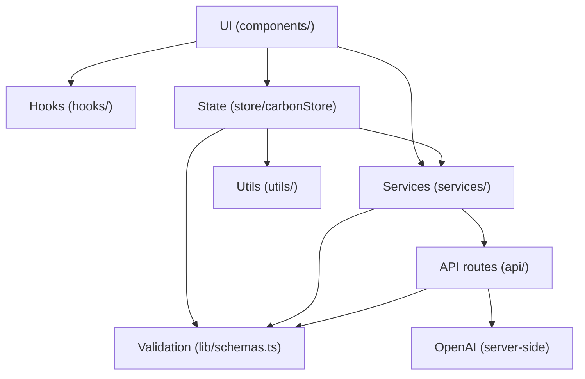

# CarbonTrack

A progressive web app that helps you measure, understand, and reduce your personal carbon footprint.

## Features

- **Carbon Assessment** — 4-step wizard covering transport, home energy, diet, and shopping with a real-time CO₂ estimate as you go
- **Dashboard** — Personalised footprint breakdown with pie chart, grade (A+ → F), and comparisons against global/US averages and the Paris 2030 target
- **Action Hub** — 16 science-backed actions ranked by your biggest impact category; log completions and track weekly savings
- **Daily Tracker** — Log meals, commutes, purchases, and energy events; streak calendar and running CO₂ balance
- **Progress Page** — Monthly trend chart, badge system, weekly AI summary, and report-card breakdown
- **AI Insights** — Optional GPT-4o-mini powered coaching tips via server-side API (requires `OPENAI_API_KEY` on deploy)
- **PWA** — Installable with offline caching via service worker
- **Dark Mode** — Toggle in the app header; respects system preference on first visit

## Tech Stack

| Layer | Technology |
|---|---|
| Framework | React 19 + Vite 5 |
| Language | TypeScript (strict mode) |
| Styling | Tailwind CSS 3 |
| State | Zustand + localStorage persistence |
| Charts | Recharts |
| Animations | Framer Motion (respects `prefers-reduced-motion`) |
| Validation | Zod (client + server) |
| AI | OpenAI SDK (server-side API routes) |
| Testing | Vitest + React Testing Library + happy-dom |

## Getting Started

### Prerequisites

- Node.js ≥ 18
- npm ≥ 9

### Installation

```bash
git clone https://github.com/your-org/carbon-tracker.git
cd carbon-tracker
npm install
```

### Environment Variables

```bash
cp .env.example .env.local
```

Open `.env.local` and set `OPENAI_API_KEY` to enable AI insights. The app runs fully offline without any env vars — AI features are optional.

### Development

```bash
npm run dev
```

Open [http://localhost:5173](http://localhost:5173). The Vite dev server proxies `/api/*` routes to the server handlers.

### Testing

```bash
npm test                # run all tests once
npm run test:watch      # watch mode
npm run test:coverage   # coverage report
```

### Build

```bash
npm run build
npm run preview         # preview the production build locally
```

### Deploy

Deploy to Vercel for full API + static hosting:

```bash
vercel --prod
```

Set `OPENAI_API_KEY` in the Vercel project environment variables.

For static-only hosting (no AI):

- **Netlify** — `netlify deploy --prod --dir dist`
- **GitHub Pages** — push `dist/` to the `gh-pages` branch

## Architecture

CarbonTrack follows a layered architecture so each concern has a clear home:



| Layer | Responsibility |
|---|---|
| `components/` | Presentational UI — no direct fetch or business rules |
| `hooks/` | Reusable React behaviour (`useTheme`, `useFocusTrap`) |
| `store/` | Client state + persistence; delegates rules to services |
| `services/` | Client-side orchestration (`aiService`, `badgeService`) |
| `utils/` | Pure functions (calculations, stats, action catalogue) |
| `lib/schemas.ts` | **Single source of truth** for Zod schemas (assessment + footprint) |
| `api/_lib/` | Server handlers, rate limiting, OpenAI calls |

**Import convention:** use `@/` for all `src/` imports (e.g. `@/services/aiService`, not relative `./` paths).

**Validation flow:** user input → Zod schema in `lib/schemas.ts` → store/API → server re-validates with the same schemas.

## Project Structure

```
api/
├── insights.ts           # Serverless insight endpoint
├── weekly-report.ts      # Serverless weekly report endpoint
└── _lib/                 # Shared handlers, validation, rate limiting
src/
├── components/
│   ├── actions/        # ActionHub + ActionCard
│   ├── common/         # Navigation, AISettingsPanel, InsightCard
│   ├── dashboard/      # Dashboard, FootprintChart, TrendLine
│   ├── onboarding/     # AssessmentFlow + step components
│   ├── progress/       # ProgressPage + section components
│   └── tracker/        # HabitTracker, AddActivityModal, LogEntry, StreakCalendar
├── hooks/
│   ├── useTheme.ts     # Dark mode toggle
│   └── useFocusTrap.ts # Accessible modal focus management
├── lib/
│   └── schemas.ts      # Zod validation schemas (single source of truth)
├── constants/
│   └── categoryMeta.ts # Shared footprint category colors and labels
├── data/
│   └── actionsCatalog.ts # Science-backed action catalogue
├── services/
│   ├── aiService.ts    # Client AI fetch + response parsing
│   ├── badgeService.ts # Badge award business rules
│   ├── streakService.ts # Streak calculation
│   └── monthlyHistoryService.ts # Monthly history updates
├── store/
│   └── carbonStore.ts  # Zustand store with localStorage persistence
├── test/               # Vitest unit + component + API tests
├── types/
│   └── index.ts        # App types (re-exports Zod-inferred types)
└── utils/
    ├── actions.ts       # getTopActions ranking logic
    ├── calculations.ts  # Footprint calculation functions
    ├── emissionFactors.ts # DEFRA/IPCC emission factors
    ├── footprintCategories.ts # Category sorting and chart helpers
    └── stats.ts         # Shared stats helpers (totals, weekly stats)
```

## Security Notes

- The OpenAI API key is stored server-side only (`OPENAI_API_KEY` env var). It is never sent to or stored in the browser.
- All user inputs are validated with Zod schemas before processing (client and server).
- API routes are rate-limited (10 requests per minute per IP).
- Error details are never exposed to the UI — generic messages are shown and details logged to the console (development only).
- The `.env.local` file is gitignored; never commit API keys.

## Emission Factor Sources

Emission factors are based on UK DEFRA 2023 greenhouse gas reporting guidelines and IPCC AR6 data. Factors are stored in `src/utils/emissionFactors.ts` and are clearly documented with units.

## Accessibility

- Semantic HTML throughout (`header`, `main`, `nav`, `section`, `footer`, `fieldset`, `legend`)
- Skip-to-main-content link on all views
- All form inputs have associated `<label>` elements
- Modals include `role="dialog"`, `aria-modal`, focus trapping, and `Escape` key dismissal
- Dynamic regions use `aria-live` for screen reader announcements
- Dark mode toggle with readable contrast in both themes
- Animations disabled when `prefers-reduced-motion: reduce` is set
- Keyboard-navigable with logical tab order and visible focus indicators
